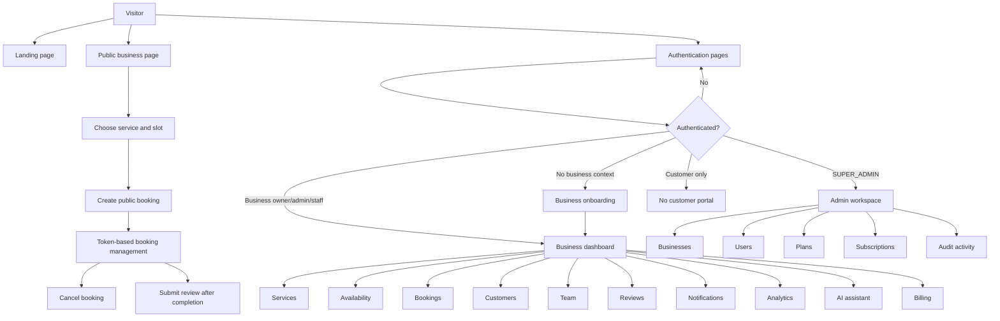
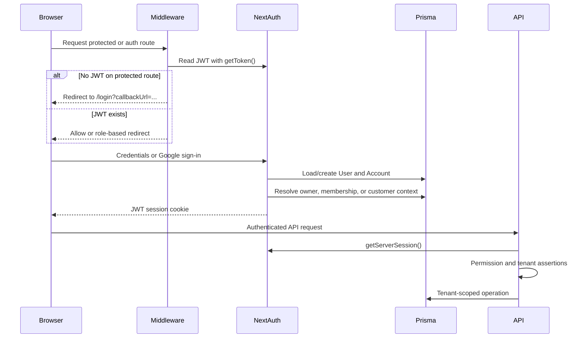
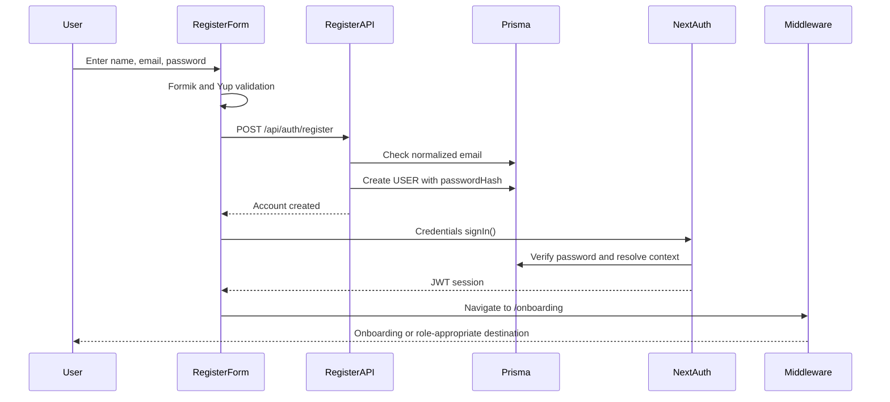
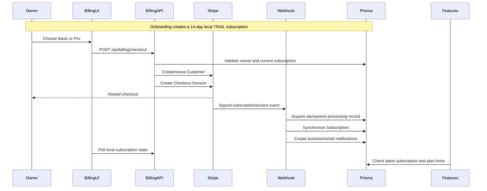
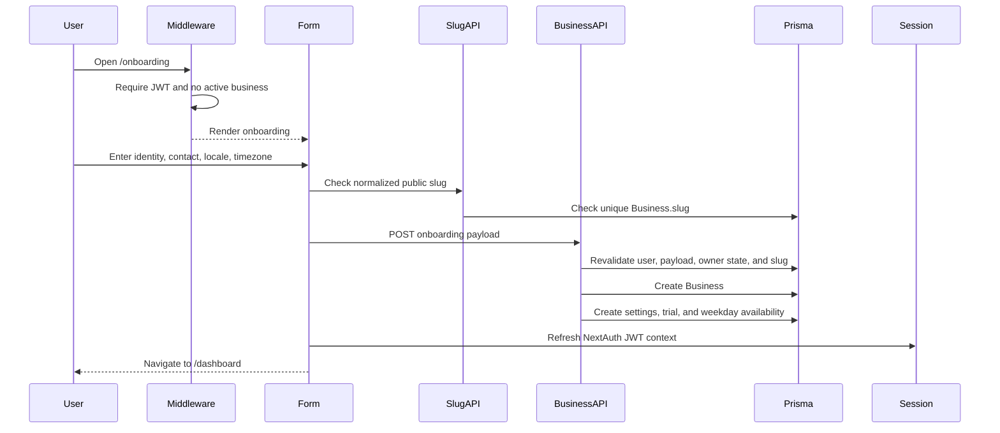
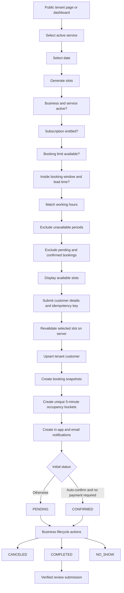
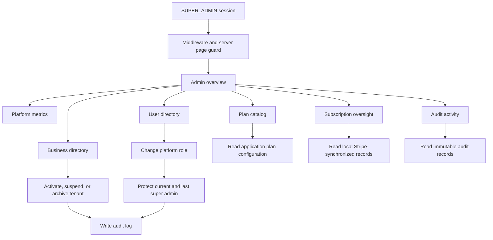

# ServiceFlow Current-State Implementation Report

**Audit date:** June 12, 2026  
**Scope:** Current workspace source code, routes, feature modules, Prisma schema, and existing project documentation.

## Audit Notes

- This report describes what the current code implements. It does not assume that external services such as MongoDB, Stripe, SMTP email, Google OAuth, or Gemini are configured in a deployed environment.
- The latest recorded verification before this audit passed `npm run i18n:check`, `npm run lint`, and `npm run build`.
- No automated unit, integration, or end-to-end test files were found.
- The working tree currently contains many uncommitted changes and untracked milestone files. The implementation exists in the workspace, but there is not yet a clean Git baseline for it.
- The application uses JavaScript rather than TypeScript.

## Executive Summary

ServiceFlow is currently a broad SaaS MVP with real end-to-end modules rather than static mock screens. The strongest implemented areas are:

- Credentials authentication, optional Google OAuth, JWT sessions, password reset, and role-aware route protection.
- Business onboarding with tenant creation, trial creation, default settings, and default availability.
- Tenant-scoped services, availability, bookings, customers, team members, reviews, notifications, analytics, and AI assistance.
- Stripe subscription checkout, billing portal access, signed webhooks, idempotent webhook processing, local entitlement state, and plan limits.
- Public booking with authoritative slot revalidation, cancellation links, notifications, and verified reviews.
- Super-admin tenant, user, plan, subscription, metric, and audit views.
- Five-language i18n support with RTL behavior for Arabic and Urdu.

The most important unfinished areas are:

- No authenticated customer portal. Customers manage bookings through possession of a booking token.
- No multi-business selector. Session context chooses the first owned business or first membership.
- Team availability and assignments do not affect slot capacity. Booking occupancy is business-wide.
- Services can require payment, but customer appointment payment is not implemented.
- The platform `ADMIN` role has no usable platform-admin workflow; only `SUPER_ADMIN` is authorized.
- No email verification, MFA, login throttling, account lockout, or global API rate limiting.
- No automated tests or background job worker.
- Admin revenue and active-user metrics are estimates; active-user measurement is incompatible with the current JWT session strategy.

---

# 1. Current Application Flow

## Diagram



## Already Implemented

| Area | Current behavior |
|---|---|
| Application shell | Next.js App Router, global providers, React Query, NextAuth, i18next, Tailwind, and shared UI components are connected. |
| Public experience | Landing page, tenant booking page, booking management link, cancellation, and review submission are available without a user session. |
| Business workspace | Dashboard routes exist for services, bookings, customers, availability, team, reviews, notifications, analytics, AI, billing, and settings. |
| Platform workspace | A separate super-admin navigation and set of management pages exists. |
| Route protection | Middleware redirects unauthenticated users and separates onboarding, dashboard, and super-admin routes. |
| Tenant isolation | Feature APIs generally resolve a business context and include `businessId` in reads and writes. |
| Subscription enforcement | Subscription state and plan limits are checked by service, booking, team, analytics, availability, and AI APIs. |
| Suspended tenant behavior | New bookings and configuration writes are blocked while existing operational booking records remain manageable. |
| Internationalization | English, German, Arabic, Spanish, and Urdu resources, cookie persistence, tenant locale fallback, and RTL direction are present. |

## Missing or Incomplete

| Gap | Impact |
|---|---|
| Landing-page buttons have no navigation action | “Start building” and “View architecture” render as buttons but do not lead anywhere. |
| No mobile dashboard navigation | The desktop sidebar is hidden below the `lg` breakpoint and no mobile menu replaces it. |
| No authenticated customer workspace | The schema contains customer-user concepts, but customers cannot sign in to view all their bookings or profile. |
| Customer records are not linked to user accounts during booking | `Customer.userId` is not populated by the booking flow, so the modeled customer session context is rarely reachable. |
| No multi-business selection | A user with several owned businesses or memberships cannot select the active tenant. |
| Limited business profile settings | Onboarding data such as business name, address, locale, and timezone has no complete owner-editing screen after creation. |
| No automated test suite | Business-critical authorization, booking concurrency, and webhook behavior rely on manual verification. |
| No background worker | Email delivery and notification creation happen inline with API requests; there is no queue processor or scheduled retry worker. |
| Dirty Git baseline | The current implementation spans a large uncommitted working tree, making release scope and regression tracking difficult. |

## Responsible Files

- Application entry and providers: [`src/app/layout.js`](../src/app/layout.js), [`src/components/providers/app-providers.jsx`](../src/components/providers/app-providers.jsx)
- Landing page: [`src/app/page.js`](../src/app/page.js)
- Route protection: [`middleware.js`](../middleware.js)
- Dashboard shell and navigation: [`src/components/layout/app-shell.jsx`](../src/components/layout/app-shell.jsx), [`src/config/navigation.js`](../src/config/navigation.js)
- Authorization helpers: [`src/features/auth/permissions.js`](../src/features/auth/permissions.js), [`src/lib/auth/guards.js`](../src/lib/auth/guards.js)
- Database model: [`prisma/schema.prisma`](../prisma/schema.prisma)
- i18n infrastructure: [`src/i18n/settings.js`](../src/i18n/settings.js), [`src/i18n/server.js`](../src/i18n/server.js), [`src/components/providers/i18n-provider.jsx`](../src/components/providers/i18n-provider.jsx)

---

# 2. Authentication Flow

## Diagram



## Already Implemented

| Capability | Current behavior |
|---|---|
| Credentials authentication | Email/password validation, normalized email lookup, and password hash verification are implemented. |
| Google OAuth | Enabled only when both Google environment variables are configured. |
| NextAuth adapter | Prisma Adapter persists users and OAuth accounts. |
| Session strategy | JWT sessions are used. |
| Session enrichment | Each JWT refresh resolves platform role, active business, business role, membership, and optional customer context. |
| Middleware guards | Auth routes, onboarding, dashboard, and admin routes are protected and redirected. |
| API guards | Server helpers require a session and apply super-admin, business-management, tenant-access, and write-access assertions. |
| Password recovery | Reset tokens are hashed, expire after one hour, become invalid after use, and can be delivered through SMTP email. |
| Password change | Authenticated credentials users can change passwords after verifying the current password. |
| Role model | Platform roles, owner/admin/staff business roles, and customer context are represented. |

## Missing or Incomplete

| Gap | Impact |
|---|---|
| No email verification flow | Credentials accounts can use the platform immediately without proving control of the email address. |
| No MFA or recovery codes | Privileged owner and super-admin accounts rely on one authentication factor. |
| No login throttling or lockout | Repeated credential attempts are not rate-limited at the application layer. |
| No session revocation after password reset | JWT sessions already issued to the user are not centrally invalidated. |
| No session/device management | Users cannot inspect or revoke active devices. |
| Platform `ADMIN` is not authorized | The enum and user-management option exist, but middleware and admin APIs accept only `SUPER_ADMIN`. |
| Single active context | Session resolution picks the first owned business, otherwise the first active membership, with no user choice. |
| Owner precedence hides memberships | A user who owns a business cannot switch into another business where they are a team member. |
| Customer role is not operational | Customer context exists in session logic, but there is no protected customer route or API suite. |
| Development fallback booking secret | Customer booking token generation falls back to a known development secret when `NEXTAUTH_SECRET` is absent. Production must never run without the real secret. |

## Responsible Files

- NextAuth configuration: [`src/features/auth/auth-options.js`](../src/features/auth/auth-options.js)
- Session context: [`src/features/auth/session-context.js`](../src/features/auth/session-context.js)
- Session access: [`src/lib/auth/session.js`](../src/lib/auth/session.js)
- API guards: [`src/lib/auth/guards.js`](../src/lib/auth/guards.js)
- Permission rules: [`src/features/auth/permissions.js`](../src/features/auth/permissions.js)
- Role constants: [`src/constants/roles.js`](../src/constants/roles.js)
- NextAuth route: [`src/app/api/auth/[...nextauth]/route.js`](../src/app/api/auth/%5B...nextauth%5D/route.js)
- Route middleware: [`middleware.js`](../middleware.js)
- Password utilities: [`src/features/auth/password.js`](../src/features/auth/password.js)
- Auth database entities: [`prisma/schema.prisma`](../prisma/schema.prisma)

---

# 3. User Registration Flow

## Diagram



## Already Implemented

| Capability | Current behavior |
|---|---|
| Registration screen | Localized name, email, password, and confirm-password form. |
| Shared validation | Yup validation is used in both the client form and API request validation. |
| Email normalization | Registration stores a normalized email address. |
| Duplicate protection | The API checks for existing email and also handles the database unique-index race. |
| Password security | Passwords are hashed before persistence. |
| Default role | New registrations receive platform role `USER`. |
| Automatic sign-in | The client attempts credentials sign-in after account creation. |
| Onboarding continuation | The default callback sends a new user to `/onboarding`. |
| OAuth alternative | Google can create a user through NextAuth when configured. |

## Missing or Incomplete

| Gap | Impact |
|---|---|
| Automatic sign-in error is not handled | After successful account creation, a failed `signIn()` can still result in navigation to onboarding without a valid session. |
| No email verification | Invalid or unowned email addresses can create accounts. |
| No terms/privacy consent | Registration does not record acceptance of legal terms. |
| No bot protection or registration throttling | Automated account creation is not controlled. |
| No invitation-aware registration handoff | Team invitation acceptance has its own route, but registration does not explicitly preserve invitation state unless the callback URL is supplied correctly. |
| No customer-account linking | Registering with an email already used in customer records does not link those `Customer` records to the new `User`. |
| No onboarding progress persistence | Registration and onboarding are separate; partially completed business details are not saved. |

## Responsible Files

- Registration page: [`src/app/(auth)/register/page.js`](../src/app/%28auth%29/register/page.js)
- Registration form: [`src/features/auth/components/register-form.jsx`](../src/features/auth/components/register-form.jsx)
- Registration API: [`src/app/api/auth/register/route.js`](../src/app/api/auth/register/route.js)
- Validation: [`src/features/auth/validation/register-schema.js`](../src/features/auth/validation/register-schema.js)
- Email normalization: [`src/features/auth/normalize-email.js`](../src/features/auth/normalize-email.js)
- Password hashing: [`src/features/auth/password.js`](../src/features/auth/password.js)
- Post-registration routing: [`middleware.js`](../middleware.js)

---

# 4. Login Flow

## Diagram

```mermaid
flowchart TD
    L[Login form] --> V[Formik and Yup validation]
    V --> N[NextAuth signIn credentials]
    N --> U[Load user by normalized email]
    U --> P[Verify password hash]
    P --> J[Create JWT]
    J --> C[Resolve session context]
    C --> R{Requested callback}
    R -->|Business user| D[/dashboard]
    R -->|No business| O[/onboarding via middleware]
    R -->|Already-authenticated SUPER_ADMIN visiting login| A[/admin]
    R -->|Fresh SUPER_ADMIN default login| ISSUE[/dashboard currently allowed]
```

## Already Implemented

| Capability | Current behavior |
|---|---|
| Localized login form | Email/password UI supports all configured languages. |
| Safe callback validation | Only same-origin relative callback paths are accepted by the client. |
| Credential validation | Login input is validated before user lookup. |
| Generic failure message | The UI does not reveal whether the email or password was incorrect. |
| Optional Google login | The button appears only when the provider is configured. |
| Session context refresh | Platform and business authorization context is loaded into the JWT. |
| Auth-route redirect | An already authenticated user visiting `/login` is redirected according to current role/context. |
| Forgot-password access | Login links to the implemented recovery flow. |

## Missing or Incomplete

| Gap | Impact |
|---|---|
| Fresh super-admin login defaults to `/dashboard` | The login form defaults to `/dashboard`, and dashboard middleware allows super admins. The intended `/admin` redirect only occurs when an already authenticated super admin revisits an auth page. |
| No rate limiting or account lockout | Brute-force resistance depends entirely on infrastructure outside the repository. |
| No MFA | Super-admin and owner login have no second factor. |
| No explicit disabled-account state | User accounts cannot be disabled independently of business suspension. |
| No login event audit | Successful and failed authentication attempts are not recorded. |
| No remembered tenant selection | Even if multi-business support is added to data, login cannot restore a selected tenant. |
| OAuth-only password UX is incomplete | Settings explain that OAuth-only users cannot change a password, but there is no explicit “set password” flow. |

## Responsible Files

- Login page: [`src/app/(auth)/login/page.js`](../src/app/%28auth%29/login/page.js)
- Login form: [`src/features/auth/components/login-form.jsx`](../src/features/auth/components/login-form.jsx)
- Login validation: [`src/features/auth/validation/login-schema.js`](../src/features/auth/validation/login-schema.js)
- Credentials provider and callbacks: [`src/features/auth/auth-options.js`](../src/features/auth/auth-options.js)
- Session context resolution: [`src/features/auth/session-context.js`](../src/features/auth/session-context.js)
- Route redirects: [`middleware.js`](../middleware.js)
- Password recovery: [`src/app/api/auth/forgot-password/route.js`](../src/app/api/auth/forgot-password/route.js), [`src/app/api/auth/reset-password/route.js`](../src/app/api/auth/reset-password/route.js)

---

# 5. Subscription Flow

## Diagram



## Already Implemented

| Capability | Current behavior |
|---|---|
| Initial trial | Business onboarding creates a 14-day `TRIALING` subscription. |
| Plan catalog | Trial, Basic, and Pro limits and display prices are defined in application configuration. |
| Billing authorization | Only the business owner or super admin can manage billing for a tenant. |
| Checkout | Basic and Pro subscription checkout sessions use configured Stripe Price IDs. |
| Stripe customer linkage | A Stripe Customer is created idempotently and linked to the business. |
| Existing subscription handling | Stripe-managed subscriptions are redirected to the billing portal instead of creating another checkout. |
| Billing portal | Owners can manage payment methods, invoices, cancellation, and Stripe-side plan changes. |
| Webhook verification | Stripe signatures are checked using the raw request body. |
| Webhook idempotency | `StripeWebhookEvent` records prevent duplicate processing and use a processing lease for recovery. |
| Subscription synchronization | Created, updated, deleted, checkout, paid-invoice, and failed-invoice events update local state. |
| Entitlement checks | Only `TRIALING` and `ACTIVE` subscriptions inside their valid periods are entitled. |
| Limit enforcement | Service count, booking count, team seats, analytics level, and AI credits are enforced in APIs. |
| Billing UI | Current plan, period, usage, configuration warnings, checkout actions, and portal access are displayed. |
| Notifications | Subscription and payment events create in-app and email notifications. |

## Missing or Incomplete

| Gap | Impact |
|---|---|
| No customer appointment payment flow | A service can set `requiresPayment`, and bookings snapshot it, but no Payment Intent or Checkout Session is created for the appointment. Such bookings remain pending until manually handled. |
| No invoice/payment entity | Local reporting stores only subscription signals and Stripe IDs, not normalized invoices, charges, refunds, taxes, or payment amounts. |
| Revenue is estimated | Admin MRR uses static configured plan prices, not actual Stripe invoice totals, discounts, taxes, refunds, or currency. |
| No scheduled webhook retry worker | Failed webhook records are retryable only when Stripe sends the event again; there is no internal recovery job or admin retry action. |
| No admin subscription repair action | The admin subscription screen is intentionally read-only and cannot trigger a Stripe resync. |
| No annual plans, metered billing, or add-ons | Only monthly Basic and Pro Price IDs are modeled. |
| No explicit grace-period policy | Past-due, unpaid, paused, and incomplete states immediately lose entitlement according to the local status rules. |
| No proration preview | Paid plan changes are delegated to the portal without an in-app preview. |
| Latest-record assumption | Most feature checks use the most recently created subscription record; data repair is required if records become incorrectly ordered or duplicated. |
| Billing UI is not fully localized | Core public/auth flows are localized, but most dashboard billing copy remains English. |

## Responsible Files

- Billing page and UI: [`src/app/(dashboard)/dashboard/billing/page.js`](../src/app/%28dashboard%29/dashboard/billing/page.js), [`src/features/billing/components/billing-management.jsx`](../src/features/billing/components/billing-management.jsx)
- Subscription API: [`src/app/api/billing/subscription/route.js`](../src/app/api/billing/subscription/route.js)
- Checkout API: [`src/app/api/billing/checkout/route.js`](../src/app/api/billing/checkout/route.js)
- Portal API: [`src/app/api/billing/portal/route.js`](../src/app/api/billing/portal/route.js)
- Stripe webhook: [`src/app/api/webhooks/stripe/route.js`](../src/app/api/webhooks/stripe/route.js)
- Billing domain logic: [`src/features/billing/server.js`](../src/features/billing/server.js), [`src/features/billing/status.js`](../src/features/billing/status.js)
- Stripe configuration: [`src/features/billing/stripe.js`](../src/features/billing/stripe.js), [`src/features/billing/stripe-price-map.js`](../src/features/billing/stripe-price-map.js)
- Plan configuration: [`src/features/billing/plan-catalog.js`](../src/features/billing/plan-catalog.js), [`src/features/businesses/plan-limits.js`](../src/features/businesses/plan-limits.js)
- Subscription persistence: [`prisma/schema.prisma`](../prisma/schema.prisma)

---

# 6. Business Onboarding Flow

## Diagram



## Already Implemented

| Capability | Current behavior |
|---|---|
| Protected onboarding route | Authentication is required; super admins and users with active business context are redirected away. |
| Multi-step form presentation | Business basics, contact/location/locale, and review sections are rendered. |
| Tenant identity | Name, slug, industry, email, phone, address, city, country, website, timezone, currency, and locale are collected. |
| Slug generation | Business name can automatically generate a normalized public slug. |
| Slug availability | Debounced client checks and authoritative server checks are implemented. |
| Reserved paths | Platform route names cannot be used as business slugs. |
| Server validation | The API repeats Yup validation and normalizes optional values and website URL. |
| Initial tenant records | Business, settings, trial subscription, and Monday-Friday 09:00-17:00 availability are created together through nested Prisma creation. |
| Trial defaults | Lead time, booking window, cancellation window, guest booking, and auto-confirm defaults are created. |
| Session refresh | The UI calls NextAuth session update before entering the dashboard. |
| One-owner-workspace policy in API | The API rejects a second non-archived owned business found for the same user. |

## Missing or Incomplete

| Gap | Impact |
|---|---|
| Owner uniqueness is not enforced by MongoDB | `Business.ownerId` has an index but is not unique. Concurrent onboarding requests could create multiple owned businesses despite the API pre-check. |
| No onboarding transaction retry strategy | Nested creation is compact, but there is no explicit handling for transient MongoDB transaction conflicts beyond slug uniqueness. |
| No first service setup | Users reach a dashboard with availability but no bookable service. |
| No logo upload or asset storage | `logoUrl` exists in the schema but onboarding cannot upload or select a logo. |
| No legal/business profile completion | Legal name and description exist in the schema but are not part of the onboarding form. |
| No post-onboarding business profile editor | Core onboarding choices cannot be fully maintained from settings. |
| Static timezone and country lists | Only a small curated set is available. |
| No locale-aware onboarding copy | Most onboarding UI and validation messages remain English. |
| No resumable draft | Refreshing or leaving the onboarding page loses entered data. |
| Onboarding status API only looks for owned businesses | It does not report an active team membership, although middleware/session context can route team members to the dashboard. |

## Responsible Files

- Onboarding page: [`src/app/(onboarding)/onboarding/page.js`](../src/app/%28onboarding%29/onboarding/page.js)
- Onboarding form: [`src/features/businesses/components/business-onboarding-form.jsx`](../src/features/businesses/components/business-onboarding-form.jsx)
- Creation API: [`src/app/api/onboarding/business/route.js`](../src/app/api/onboarding/business/route.js)
- Slug API: [`src/app/api/onboarding/slug/route.js`](../src/app/api/onboarding/slug/route.js)
- Status API: [`src/app/api/onboarding/status/route.js`](../src/app/api/onboarding/status/route.js)
- Validation: [`src/features/businesses/validation/onboarding-schema.js`](../src/features/businesses/validation/onboarding-schema.js)
- Defaults: [`src/features/businesses/onboarding-defaults.js`](../src/features/businesses/onboarding-defaults.js)
- Slug rules: [`src/features/businesses/slug.js`](../src/features/businesses/slug.js)
- Session refresh context: [`src/features/auth/session-context.js`](../src/features/auth/session-context.js)
- Business models: [`prisma/schema.prisma`](../prisma/schema.prisma)

---

# 7. Booking Flow

## Diagram



## Already Implemented

| Capability | Current behavior |
|---|---|
| Public booking page | Loads tenant identity, active services, published reviews, locale, timezone, and current booking access. |
| Dashboard booking creation | Owners and admins can create bookings using the same authoritative slot engine. |
| Slot generation | Uses business timezone, working-day ranges, slot interval, service duration, buffers, service-specific ranges, unavailable periods, and current bookings. |
| Booking policy | Lead time, future booking window, guest booking permission, auto-confirm, and cancellation window are configurable. |
| Subscription and suspension checks | New slots and bookings are blocked for inactive businesses, expired subscriptions, and exhausted plan limits. |
| Same-day rule | Booking creation explicitly rejects appointments crossing midnight. |
| Authoritative revalidation | The submitted start time must still exist in a newly generated server slot list. |
| Double-booking prevention | Unique five-minute occupancy buckets protect against concurrent bookings after the availability read. |
| Idempotency | Each tenant has a unique booking idempotency key, and safe retries return the original booking. |
| Tenant customer creation | Customer profiles are upserted by tenant and normalized email. |
| Historical snapshots | Service name, duration, price, currency, payment requirement, and buffers are copied into the booking. |
| Lifecycle rules | Pending can confirm/cancel; confirmed can complete, no-show, or cancel. Completion and no-show are time constrained. |
| Existing booking operations | Existing bookings remain visible and operational for suspended or non-entitled tenants. |
| Staff restrictions | Staff list and operate only bookings assigned to their membership. |
| Assignment | Owners can assign bookings only to active members authorized for the service. |
| Customer cancellation | A hashed booking-access token and tenant-configured cancellation deadline protect cancellation. |
| Notifications | Creation, status changes, and customer cancellation generate in-app and email records. |
| Reviews | Completed bookings can submit one token-authorized review for moderation. |
| Schedule-change rule | Availability changes affect future slot generation and do not rewrite existing booking snapshots. |

## Missing or Incomplete

| Gap | Impact |
|---|---|
| Capacity is business-wide | Occupancy uses `resourceKey: "BUSINESS"`. Two staff members cannot accept simultaneous appointments even when both are available. |
| Staff availability is not used in slot generation | `StaffAvailability` and service assignments are maintained, but public slots are generated only from business/service availability. |
| Staff selection is not part of booking | Customers cannot choose a team member, and the engine cannot assign an available resource during creation. |
| Customer payment is not implemented | `paymentRequiredSnapshot` changes the initial status to pending, but there is no appointment payment session, payment status, refund, or confirmation webhook. |
| No rescheduling | A booking cannot move to another slot; it must be canceled and recreated manually. |
| No recurring bookings, waitlist, or group capacity | The engine handles one appointment occupying the whole business resource. |
| No explicit booking expiration | Pending bookings continue occupying slots until manually changed. This is especially important for future paid bookings. |
| No customer authenticated history | Management requires an individual tokenized confirmation link. |
| No customer-user linking | Booking customer upsert does not associate an existing `User` by email. |
| No ICS/calendar integration | Calendar files, Google Calendar sync, and external conflict checking are absent. |
| Notification delivery is inline | API response time can include external email delivery, and automatic retry is not delegated to a worker. |
| Token recovery is absent | If the customer loses the confirmation link, there is no secure “find my booking” recovery flow. |
| Dashboard localization is partial | Public booking is localized, while most owner booking-management copy remains English. |

## Responsible Files

- Public business page: [`src/app/(public)/[businessSlug]/page.js`](../src/app/%28public%29/%5BbusinessSlug%5D/page.js)
- Public form: [`src/features/bookings/components/public-booking-form.jsx`](../src/features/bookings/components/public-booking-form.jsx)
- Public creation API: [`src/app/api/public/businesses/[businessSlug]/bookings/route.js`](../src/app/api/public/businesses/%5BbusinessSlug%5D/bookings/route.js)
- Public slots API: [`src/app/api/public/businesses/[businessSlug]/slots/route.js`](../src/app/api/public/businesses/%5BbusinessSlug%5D/slots/route.js)
- Booking management page: [`src/app/(dashboard)/dashboard/bookings/page.js`](../src/app/%28dashboard%29/dashboard/bookings/page.js)
- Booking management UI: [`src/features/bookings/components/booking-management.jsx`](../src/features/bookings/components/booking-management.jsx)
- Dashboard booking API: [`src/app/api/bookings/route.js`](../src/app/api/bookings/route.js)
- Booking creation domain logic: [`src/features/bookings/server.js`](../src/features/bookings/server.js)
- Slot engine: [`src/features/bookings/slot-service.js`](../src/features/bookings/slot-service.js), [`src/features/availability/slots.js`](../src/features/availability/slots.js)
- Access and plan rules: [`src/features/bookings/access.js`](../src/features/bookings/access.js), [`src/features/bookings/policy.js`](../src/features/bookings/policy.js)
- Lifecycle rules: [`src/features/bookings/lifecycle.js`](../src/features/bookings/lifecycle.js), [`src/features/bookings/constants.js`](../src/features/bookings/constants.js)
- Occupancy locking: [`src/features/bookings/occupancy.js`](../src/features/bookings/occupancy.js), [`prisma/schema.prisma`](../prisma/schema.prisma)
- Customer management link: [`src/features/customers/server.js`](../src/features/customers/server.js)
- Cancellation: [`src/app/api/public/businesses/[businessSlug]/bookings/[bookingNumber]/cancel/route.js`](../src/app/api/public/businesses/%5BbusinessSlug%5D/bookings/%5BbookingNumber%5D/cancel/route.js)
- Notifications: [`src/features/notifications/events.js`](../src/features/notifications/events.js), [`src/features/notifications/server.js`](../src/features/notifications/server.js)
- Reviews: [`src/app/api/public/businesses/[businessSlug]/bookings/[bookingNumber]/review/route.js`](../src/app/api/public/businesses/%5BbusinessSlug%5D/bookings/%5BbookingNumber%5D/review/route.js)

---

# 8. Admin Flow

## Diagram



## Already Implemented

| Capability | Current behavior |
|---|---|
| Admin isolation | Middleware, server pages, and admin APIs all require `SUPER_ADMIN`. |
| Overview metrics | Estimated MRR/ARR, plan distribution, subscription status, tenant counts, user counts, risk signals, and recent businesses are displayed. |
| Business management | Search, filter, paginate, activate, suspend, and archive tenants. Restrictive changes require a reason. |
| User management | Search, filter, paginate, and change platform roles. |
| Super-admin safety | A super admin cannot change their own role, and the final super admin cannot be demoted. |
| Plan oversight | Displays configured prices, limits, tenant distribution, entitlement count, estimated MRR, and Stripe Price readiness. |
| Subscription oversight | Searchable, filterable read-only view of plan, status, period, payment signals, and Stripe linkage. |
| Activity log | Sensitive business-status and platform-role changes are audited with actor, target, reason, and metadata. Other implemented modules also add team, assignment, review, and AI audit events. |
| Tenant lifecycle enforcement | A status change immediately affects booking creation and configuration-write guards across tenant APIs. |
| Concurrency checks | Business-status and role updates use current-state conditions to detect conflicting updates. |

## Missing or Incomplete

| Gap | Impact |
|---|---|
| Platform `ADMIN` has no access | Users can be assigned `ADMIN`, but all platform pages and APIs still require `SUPER_ADMIN`. |
| Active-user metrics are inaccurate | NextAuth uses JWT sessions, so database `Session` records are not the active-session source. Admin “active users” may remain zero or stale. |
| Revenue metrics are estimates | MRR/ARR use configured monthly prices and local status, not actual invoice revenue, discounts, tax, refunds, or multiple currencies. |
| Trial conversion is a proxy | The displayed rate is active paid divided by active paid plus currently trialing, not cohort conversion. |
| Plans are not editable | Plan limits and prices are code/environment configuration; the admin page is read-only. |
| Subscriptions are not repairable from admin | There is no manual Stripe resync, webhook replay, refund, credit, or cancellation action. |
| No detailed tenant workspace | Admin can change tenant status but cannot open a full tenant detail, support timeline, or controlled impersonation session. |
| No user suspension/deletion | Platform role can change, but account access itself cannot be disabled. |
| No admin audit filters/export | Activity is paginated only and cannot be filtered by action, actor, tenant, or date. |
| Audit coverage is incomplete | Authentication, Stripe synchronization, customer changes, service changes, and availability changes are not all represented in `AuditLog`. |
| Archiving is a status change only | It does not anonymize data, revoke sessions, or execute a retention/deletion workflow. |
| No operational job console | Failed email deliveries and webhook failures are counted but not centrally retried or resolved. |

## Responsible Files

- Admin route guard: [`src/features/admin/page-access.js`](../src/features/admin/page-access.js), [`middleware.js`](../middleware.js)
- Admin overview: [`src/app/(admin)/admin/page.js`](../src/app/%28admin%29/admin/page.js), [`src/features/admin/components/super-admin-dashboard.jsx`](../src/features/admin/components/super-admin-dashboard.jsx)
- Metric calculations: [`src/features/admin/metrics.js`](../src/features/admin/metrics.js)
- Admin API guard and pagination: [`src/features/admin/server.js`](../src/features/admin/server.js)
- Business API: [`src/app/api/admin/businesses/route.js`](../src/app/api/admin/businesses/route.js), [`src/app/api/admin/businesses/[businessId]/route.js`](../src/app/api/admin/businesses/%5BbusinessId%5D/route.js)
- User API: [`src/app/api/admin/users/route.js`](../src/app/api/admin/users/route.js), [`src/app/api/admin/users/[userId]/route.js`](../src/app/api/admin/users/%5BuserId%5D/route.js)
- Plan API: [`src/app/api/admin/plans/route.js`](../src/app/api/admin/plans/route.js)
- Subscription API: [`src/app/api/admin/subscriptions/route.js`](../src/app/api/admin/subscriptions/route.js)
- Activity API: [`src/app/api/admin/activity/route.js`](../src/app/api/admin/activity/route.js)
- Admin validation: [`src/features/admin/validation/admin-schema.js`](../src/features/admin/validation/admin-schema.js)
- Admin pages and components: [`src/app/(admin)/admin`](../src/app/%28admin%29/admin), [`src/features/admin/components`](../src/features/admin/components)
- Audit persistence: [`prisma/schema.prisma`](../prisma/schema.prisma)

---

# Cross-Cutting Implementation Status

## Implemented Supporting Modules

| Module | Current state |
|---|---|
| Services | Create, edit, delete when unused, activate/deactivate, tenant scoping, entitlement and plan limits. |
| Availability | Business/service working ranges, overlap prevention, unavailable dates, activation, subscription enforcement. |
| Customers | Tenant CRM list, search, filters, create/edit/delete rules, booking history, marketing consent. |
| Team | Invitations, acceptance, owner-only management, role changes, service assignments, staff availability, seat limits, audit records. |
| Reviews | Booking-verified submission, one review per booking, moderation, public published-review display. |
| Notifications | In-app and Nodemailer SMTP email delivery, dedupe keys, status tracking, and manual retry APIs/UI. |
| Analytics | Basic 30-day analytics and Pro flexible periods with subscription enforcement. |
| AI | Gemini GenerateContent integration, plan credits, reservations, approval/rejection, application to supported content, token/cost metadata. |
| i18n | Five languages, public/auth translation, locale cookie, tenant fallback, localized dates/money, and RTL support. |

## Principal Architecture Risks

| Priority | Risk |
|---|---|
| High | Business-wide occupancy prevents valid parallel team bookings and does not use staff availability. |
| High | Paid appointment services have no actual payment lifecycle. |
| High | No automated tests cover authorization, tenant isolation, webhook handling, or booking concurrency. |
| High | Owner uniqueness is application-enforced only, while session context supports only one automatic active tenant. |
| High | No authentication throttling, email verification, MFA, or JWT session revocation. |
| Medium | Customer account modeling is disconnected from the public booking experience. |
| Medium | Synchronous email delivery can slow API responses and lacks a worker retry model. |
| Medium | Admin active-user and revenue metrics can be misleading. |
| Medium | Dashboard localization is incomplete despite five-language infrastructure. |
| Medium | Mobile navigation is absent for dashboard and admin workspaces. |

## Current Readiness Assessment

| Dimension | Assessment |
|---|---|
| Product demonstration | Strong. Most SaaS flows can be demonstrated end to end when dependencies are configured. |
| Internal MVP pilot | Moderate. Suitable after focused test coverage, environment validation, and booking-capacity decisions. |
| Production billing | Partial. SaaS subscriptions are substantially implemented; appointment payments and financial reconciliation are not. |
| Production security | Partial. Core authorization is thoughtful, but account verification, throttling, MFA, session revocation, and security testing are missing. |
| Multi-tenant correctness | Good at API query level, but active-tenant selection and owner uniqueness require strengthening. |
| Booking production readiness | Good for a single-capacity business. Not ready for parallel staff/resource scheduling. |
| Operations readiness | Partial. Admin visibility exists, but retry jobs, exports, monitoring integration, and repair tooling are limited. |
| Release readiness | Not yet. The project needs a clean Git baseline, automated tests, deployment configuration validation, and resolution of the high-priority risks above. |

